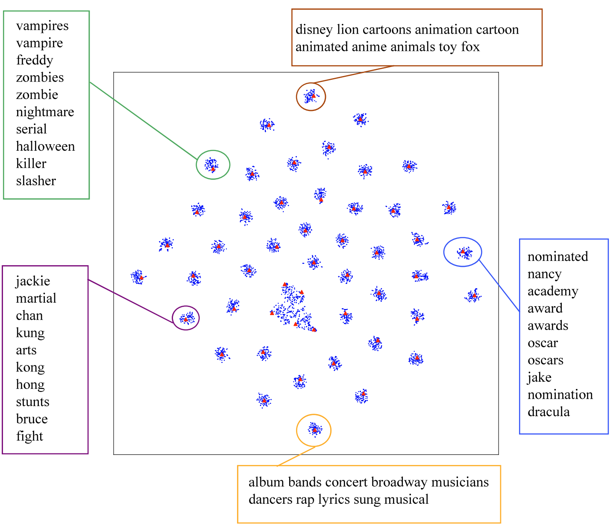

# Code for Effective Neural Topic Modeling with Embedding Clustering Regularization (ICML2023)

[ICML 2023](https://arxiv.org/pdf/2306.04217)

## Usage

### 1. Prepare environment

    torch==1.7.1
    scipy=1.7.3
    scikit-learn==0.23.2
    gensim==4.0.1
    pyyaml==6.0

Prepare coherence evaluation:

1. Install java.

        sudo apt install openjdk-11-jdk

2. Download $C_V$ [java jar](https://hobbitdata.informatik.uni-leipzig.de/homes/mroeder/palmetto/palmetto-0.1.0-jar-with-dependencies.jar) to `./ECRTM/palmetto`. It is developed by [palmetto](https://github.com/dice-group/Palmetto).

3. Download and extract [preprocessed Wikipedia articles](https://hobbitdata.informatik.uni-leipzig.de/homes/mroeder/palmetto/Wikipedia_bd.zip) to `./ECRTM/palmetto/wikipedia` as the reference corpus.

### 2. Train and evaluate the model

We provide a shell script `./ECRTM/scripts/run.sh` to train and evaluate our model.

Change to directory `./ECRTM`, and run commands as

    ./scripts/run.sh ECRTM 20NG 50
    ./scripts/run.sh ECRTM IMDB 50
    ./scripts/run.sh ECRTM YahooAnswer 50
    ./scripts/run.sh ECRTM AGNews 50

## Preprocess datasets (Optional)

Datasets in `./data` have been preprocessed before.
Here we provide a shell script to show how we preprocess these datasets:

    ./scripts/preprocess.sh

This can be used to preprocess other datasets.

## Citation

If you want to use our code, please cite as

    @inproceedings{wu2023effective,
        title={Effective neural topic modeling with embedding clustering regularization},
        author={Wu, Xiaobao and Dong, Xinshuai and Nguyen, Thong and Luu, Anh Tuan},
        booktitle={International Conference on Machine Learning},
        year={2023},
        organization={PMLR}
    }
